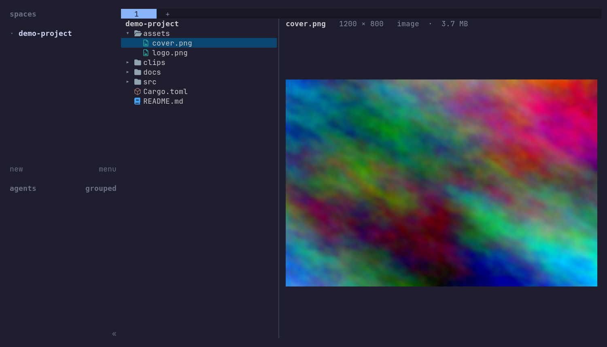
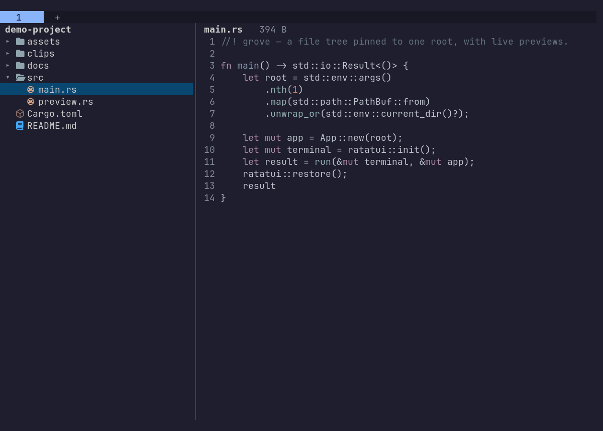

# grove

**A file tree pinned to one root, with live previews, in a single herdr pane.**

[](https://github.com/saborrie/grove/actions/workflows/ci.yml)
[](https://github.com/saborrie/grove/releases/latest)
[](LICENSE)



Yazi's previews and a VS Code tree, and nothing else at all.

> **grove is built for [herdr](https://herdr.dev).** Pictures are drawn through
> herdr's pane graphics API, so herdr is what makes the previews possible — and
> the previews are the point. Run grove in a herdr pane. Outside one it still
> starts, and you get the tree, the keys and text previews, but every image,
> video and PDF degrades to a text card.

## Why "grove"?

A grove is a stand of trees with no undergrowth — small enough to know, open
enough to see all the way through. That is the whole design brief: **one** tree,
rooted where you left it, with a clear view of whatever you are standing in front
of. No tabs, no panels, no modes, no undergrowth.

## What it is

Terminal file managers make you choose. Yazi has the best previews of anything in
a terminal, but its Miller columns mean the view slides sideways as you walk and
there is no tree — a shape its maintainers have declined more than once. Tree-first
tools like broot re-root when you press Enter and trim the tree to fit rather than
letting you fold it yourself. VS Code's Explorer has exactly the right shape, and
lives inside an editor.

grove is the small intersection: the tree shape, one fixed root, and real pictures.

- **Made for a herdr pane.** No plugin manifest, no install step, no hooks — it is
  a plain binary you run in whichever pane you happen to be in, and it stays in
  that one pane.
- **The root never moves.** It is wherever you launched grove (`grove [path]`), not
  wherever a neighbouring shell wandered off to. Point it at a directory full of
  repos and worktrees and it stays pointed there.
- **One pane.** The tree and the preview live together. Nothing ever opens a tab,
  splits a pane, or steals your focus.
- **Previews that earn the pane** — syntax-highlighted text with line numbers,
  images, video, the first page of a PDF, and a listing for directories. The
  preview follows the cursor, so walking the tree *is* browsing.
- **It follows the disk.** Files an agent, a build or a `git checkout` writes,
  deletes or renames appear in the tree on their own, and a file being written
  while you read it re-renders in place. Nothing to press, nothing to configure.



- **Arrows and Enter.** That is the entire keyboard surface, on purpose.

## Keys and mouse

| | |
| --- | --- |
| `↑` `↓` | Move |
| `→` | Expand a folder |
| `←` | Collapse it, or step out to the parent |
| `Enter` | Toggle a folder — or force a re-read of everything, when you would rather be sure than wait a quarter-second |
| `Ctrl+C` | Quit |
| Click | Select a row; on a folder, fold it |
| Wheel | Scroll whichever half the pointer is over — the tree stays where you put it until the arrows move again |

There is nothing else to learn, and nothing else to accidentally press.

## Following the disk

grove re-reads a directory when that directory's mtime moves, which is exactly
when an entry has been added, removed or renamed. It checks four times a second,
so a file something else just wrote is on screen before you have finished looking
back at the pane. The previewed file is watched the same way, by mtime and size,
and re-renders where you had it scrolled to rather than snapping back to the top.

It is a `stat` per **visible** directory, not a filesystem watch. Folding a folder
stops it being watched, so the cost tracks what is on screen rather than the size
of the tree — around 0.2% of one core with forty folders open. That choice is
deliberate: watches are the thing that quietly stops working on an NFS or SSHFS
mount, in a container that has run out of inotify quota, and across
`herdr --remote`, which is where grove is often standing.

A write *inside* a file leaves the tree alone. The tree shows names, and
rebuilding it because a log grew would be churn nobody can see.

## Pictures

**This is the part that requires herdr.** Images go through herdr's pane graphics
API (`pane.graphics.set`), so herdr owns the kitty protocol, the outer terminal
and the SSH bridge — grove just hands over a PNG and a cell rectangle. That is why
grove needs no graphics stack of its own, no terminal capability detection and no
temp files, and why previews work unchanged over `herdr --remote` and on mobile
clients.

It also means grove draws no pictures anywhere else. Outside a herdr pane the tree,
the keys and text previews all work, and media files show a text card explaining
why — useful enough to debug with, but not what grove is for.

The canvas is padded to a whole number of cells and placed on a rectangle of
exactly that shape, so pictures keep their aspect ratio instead of stretching to
fill the pane, and are never upscaled past their own resolution.

| Kind | Needs | Notes |
| --- | --- | --- |
| Images | — | png, jpeg, gif, webp, bmp, tiff built in |
| Images (avif, heic, jxl…) | `ffmpeg` | Used automatically when the built-in decoders decline |
| Video | `ffmpeg`, `ffprobe` | A frame from 15% in, because first frames are usually black, plus duration and codec |
| PDF | `pdftoppm`, `pdfinfo` (poppler-utils) | First page, and the page count |
| Audio | `ffprobe` | Duration and codec |

Each is optional. Without one, that file type shows the reason instead of a picture.

## Install

Requires [herdr](https://herdr.dev) 0.8 or newer, with pane graphics left on
(they are on by default).

### Linux — x86_64 or arm64

```sh
curl -fsSL https://raw.githubusercontent.com/saborrie/grove/main/scripts/install.sh | sh
```

That fetches the latest release into `~/.local/bin`, checking its SHA-256 first.
The binaries are statically linked against musl, so they run on any Linux without
matching a glibc version or installing a toolchain.

```sh
GROVE_VERSION=0.1.0 GROVE_INSTALL_DIR=/usr/local/bin \
    curl -fsSL https://raw.githubusercontent.com/saborrie/grove/main/scripts/install.sh | sh
```

Prefer to look before you pipe? The script is
[`scripts/install.sh`](scripts/install.sh), and every release carries the same
tarballs and `.sha256` files on its
[releases page](https://github.com/saborrie/grove/releases).

### From source

Needs a [Rust toolchain](https://rustup.rs). Any platform herdr runs on:

```sh
cargo install --git https://github.com/saborrie/grove
```

or from a checkout:

```sh
git clone https://github.com/saborrie/grove
cd grove
cargo build --release
install -m755 target/release/grove ~/.local/bin/
```

grove is not on crates.io — the name is held by an unrelated, long-abandoned
crate, and `cargo install` needs a toolchain anyway, which is what the install
script exists to avoid.

### Running it

```sh
grove            # rooted here
grove ~/work     # rooted there
```

Split a pane for it and leave it there — that is the intended shape:

```sh
herdr pane split --current --direction right --ratio 0.5
```

## Configuration

There is none worth the name, deliberately:

| Variable | Effect |
| --- | --- |
| `GROVE_THEME=light` | Light palette and a light syntax theme |
| `GROVE_ICONS=emoji` / `material` | Force an icon set instead of probing for a Nerd Font |

## Regenerating the screenshots

The images in this README are generated, not taken:

```sh
./scripts/record-demo.sh          # image scenario, the default
./scripts/record-demo.sh code     # or: video, pdf
```

Docker is the only requirement. The script builds a container holding kitty,
herdr, a Nerd Font and grove, brings up a virtual X display, runs herdr inside a
real kitty on it, runs grove inside that, walks the tree with arrow keys and
photographs the X root window.

The shots keep herdr's own frame — the spaces sidebar and the tab bar — because
grove is a herdr program and a picture of it sitting in a herdr session says so
without a caption. `CROP_LEFT=300` trims it off if you want grove alone.

It has to work that way. The usual approach — asciinema plus a renderer like agg —
records the escape-sequence stream, and grove's previews are not in it: herdr
composites them as kitty graphics outside the text grid. A recording would show
a perfect tree beside an empty rectangle. The only way to photograph a picture is
to render one.

## Releasing

Cargo.toml holds the version; a tag says which commit is that version. Pushing a
tag that matches is the whole release process — CI checks the two agree, builds
both Linux targets, and publishes the release only if every binary built.

```sh
# 1. bump `version` in Cargo.toml, commit it
# 2. tag that commit with the same number, no `v` prefix
git tag 0.2.0
git push origin 0.2.0
```

`ci.yml` runs `cargo fmt --check`, `cargo clippy -D warnings` and the tests on
every push to main and every pull request.

## Where the code came from

grove began as a strip-down of [herdr-sidebar](https://github.com/alexarthurs/herdr-sidebar)
by Alex Arthurs, and four files are taken from it essentially unchanged:

| File | What it does |
| --- | --- |
| `src/tree.rs` | The tree model — expansion state, cached listings, VS Code ordering |
| `src/wrap.rs` | Width-aware wrapping of styled lines, so continuations stay scrollable |
| `src/icons.rs` | The file-type icon set, in Nerd Font and emoji themes |
| `src/syntax.rs` | syntect highlighting with bat's extended grammars |

They arrived with their tests, which still run here. What did **not** come across is
most of it: the source control panel, activity bar, editor, quick-open, settings
overlay, font installer, folder-following and all the pane and tab orchestration.
grove adds the single pane layout, the preview document model, and the media
previews.

If you want a file tree *plus* source control, staging, diffs, AI commit messages
and an editor, docked as a real sidebar — use herdr-sidebar. It is the more capable
tool. grove is the one that does one thing.

## License

MIT — see [LICENSE](LICENSE), which carries both copyright lines.
